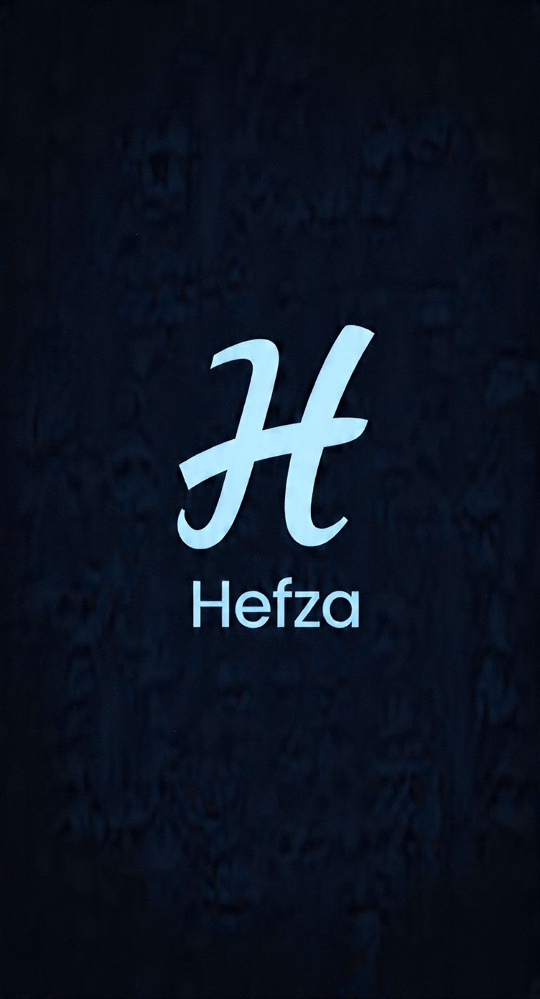

# AUREX Internship | Week 2: Responsive Portfolio

  
  <h3>Modern Responsive Portfolio Website</h3>
  
Built with pure HTML5 & CSS3 | Grid, Flexbox & Mobile-First Design

---

## 👩‍💻 About Me
**Name:** Hefza Munsha  
**Track:** Web Development - Full Stack  
**Goal:** Crafting clean, accessible, and pixel-perfect web experiences.

## 🚀 Live Demo
**Portfolio:** [View Live Site](https://Hefza Munsha55.github.io/aurex-web-internship-hefza-week2)  
*Deployed on GitHub Pages*

## 🛠️ Tech Stack & Features Implemented
This week I focused on modern CSS layout techniques instead of frameworks.

| Feature | Implementation | Why it matters |
| --- | --- | --- |
| **CSS Grid** | `grid-template-columns: repeat(auto-fit, minmax(180px, 1fr))` | Fully responsive skill cards without media queries |
| **Flexbox** | Used in Navbar & Hero section | Perfect alignment and centering across devices |
| **Mobile-First** | `@media (max-width: 768px)` breakpoints | Optimized UX from 320px to 1440px screens |
| **Modern UI** | `linear-gradient`, `box-shadow`, `backdrop-filter` | Clean, light-pink theme with depth |
| **Micro-interactions** | `transform: translateY()` on hover | Engaging user feedback |

## 📸 Responsive Previews
| Desktop | Tablet | Mobile |
| --- | --- | --- |
| Screenshot here | Screenshot here | Screenshot here |
*Add your 3 screenshots here after taking them*

## 💡 Key Learnings
1.  **Layout Logic**: Grid is for 2D layouts, Flexbox is for 1D. Knowing when to use which was a game-changer.
2.  **Design Systems**: Stuck to a 2-color palette `#FFE4E1` and `#C44569` for consistency.
3.  **Accessibility**: Used semantic HTML tags and proper color contrast for readability.

## ⚡ Challenges & Solutions
- **Challenge:** Making the skill grid collapse to 1 column on mobile without breaking.  
  **Solution:** Used `auto-fit` + `minmax()` so the browser handles it automatically.
- **Challenge:** Text readability on light pink backgrounds.  
  **Solution:** Tested contrast ratios and used dark pink `#A23B5A` for body text.

## 📂 Project Structure